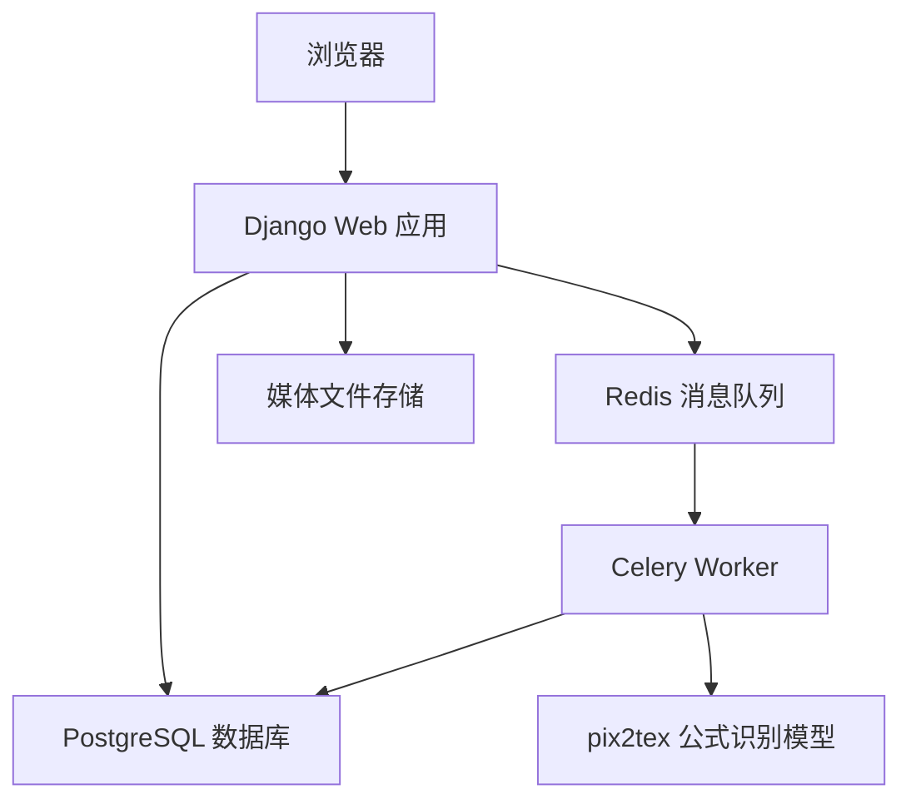

# 总体架构

## 架构目标

Formula Lab 的架构目标是让一个公式识别网站同时满足三个条件：

- 可以在课程验收环境中稳定运行。
- 具备现代 Web 应用的真实工程结构。
- 后续可以替换识别模型、扩展历史记录和增加更复杂的任务处理能力。

## 总体结构



系统由四个主要服务组成：

- `web`：Django Web 服务，负责页面、上传、API 和历史记录。
- `worker`：Celery 后台任务服务，负责调用公式识别模型。
- `db`：PostgreSQL 数据库，负责保存任务和识别结果。
- `redis`：Redis 服务，负责 Celery 消息队列。

## 请求处理思路

用户上传图片时，Django 不直接在请求中执行模型推理。Django 只负责保存图片、创建 `FormulaJob` 记录，并把任务投递给 Celery。

后台 worker 收到任务后执行识别，并持续更新数据库中的任务状态。前端进度页通过 API 轮询任务状态，任务完成后跳转到结果页。

这种设计避免了耗时识别阻塞 HTTP 请求，也让进度条有真实的后端状态来源。

## 分层设计

项目按以下层次组织：

```text
Presentation Layer     页面与交互
Web Application Layer  Django view、URL、API
Domain Layer           FormulaJob 等业务模型
Async Task Layer       Celery 任务
Recognition Layer      pix2tex 识别引擎适配
Infrastructure Layer   Docker、PostgreSQL、Redis、媒体文件
```

每一层只承担自己的职责。Django view 不直接了解 pix2tex 的内部细节，Celery task 也不直接处理页面展示逻辑。这样的边界便于调试、测试和扩展。

## 工程命名与界面叙事

Formula Lab 在工程层保持清晰命名，在界面层使用 Mission Control 叙事。

工程层：

```text
FormulaJob        一次公式识别任务
Celery task       后台识别任务
Recognition stage 识别阶段
System health     系统健康状态
```

界面层：

```text
Mission              一次可观察的识别任务
Recognition sequence 识别序列
Launch sequence      进度阶段展示
Mission log          历史记录
Telemetry            系统状态
Mission report       识别结果页
Control console      LaTeX 源码面板
Payload preview      公式渲染预览
```

这样可以同时满足两个目标：

- 代码和数据库模型不被过度装饰，便于维护。
- 用户界面形成统一的 SpaceX-inspired Mission Control 产品气质。

任何实现时，如果工程命名和 UI 文案冲突，应优先保证代码层清晰，UI 层通过模板文案完成产品叙事。

## 为什么使用 Celery

公式识别属于耗时任务，模型首次加载也可能很慢。如果直接在 HTTP 请求中执行识别，浏览器会长时间等待，甚至出现超时。

Celery 的作用是把耗时任务从 Web 请求中拆出去：

- 上传请求可以快速返回。
- 识别过程可以在后台执行。
- 前端可以展示真实任务阶段。
- 失败任务可以记录错误信息。
- 后续可以扩展重试、批量任务和队列管理。

## 为什么使用 PostgreSQL

Formula Lab 需要保存历史记录、任务状态、识别结果、错误信息和耗时统计。这些都是业务数据，应该放在可靠的关系型数据库中。

PostgreSQL 的优势是：

- 稳定可靠，适合真实 Web 应用。
- 与 Django ORM 配合成熟。
- 后续可以扩展更多结构化查询。
- 与 Docker Compose 组合清晰。

## 为什么 Redis 不保存业务数据

Redis 在本项目中只负责消息队列和 Celery backend，不作为业务数据库。业务数据统一写入 PostgreSQL。

这样可以避免数据来源混乱：

```text
PostgreSQL = 可信业务状态
Redis      = 任务队列和临时状态
```

如果 Redis 重启或清空，历史识别记录仍然保存在 PostgreSQL 中。
