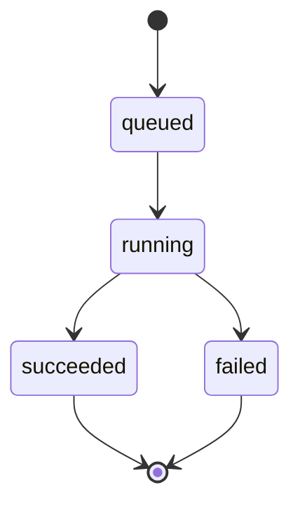

# 数据模型

## 核心模型

第一版 Mission Control 已经有一个可运行的识别任务模型：`FormulaJob`。Product Core Foundation 在它外层引入 Projects-first 的业务层：

```text
PaperProject
  -> ProjectMembership
  -> PaperDocument
    -> PaperFile
      -> PaperFileVersion
      -> PaperAnnotation
        -> PaperChangeSuggestion
  -> BatchMission
    -> FormulaItem
      -> optional FormulaJob
```

`FormulaJob` 继续表示一次公式图片识别任务，从上传图片开始，到识别成功或失败结束。它不被一次性替换，而是可以按需挂到项目、批次或公式条目下。

在 UI 层，`FormulaJob` 可以被称为 `Mission` 或 `Recognition Mission`。这是界面叙事，不改变数据库模型名称。

## Product Core 模型

### PaperProject

`PaperProject` 表示一篇论文或一次交付项目，是后续文档、文件、批次、公式条目和导出工作的归属容器。

核心字段：

```text
id                    UUID 主键
project_code          面向用户展示的项目编号
name                  项目名称
writing_goal          写作目标或论文用途
default_export_format 默认导出格式
created_at            创建时间
updated_at            更新时间
```

### PaperDocument

`PaperDocument` 表示项目中的一份论文文档，是后续在线 LaTeX 编辑器、PDF preview 和协作能力的文档边界。

核心字段：

```text
id              UUID 主键
document_code   面向用户展示的文档编号
project         所属 PaperProject
title           文档标题
root_file_path  主入口文件，默认 main.tex
created_at      创建时间
updated_at      更新时间
```

### PaperFile

`PaperFile` 表示一份论文文档中的单个源文件，例如 `main.tex`、章节 `.tex` 或参考文献 `.bib`。

核心字段：

```text
id          UUID 主键
document    所属 PaperDocument
path        文档内相对路径
file_type   文件类型
content     文件内容
sort_order  文件树排序
created_at  创建时间
updated_at  更新时间
```

当前 `path` 必须是安全相对路径，禁止绝对路径、`.` 和 `..`，并且同一份文档内路径唯一。第一版默认创建 `main.tex`，后续文件树、PDF 编译和协作编辑都会以 `PaperFile` 为操作对象。

### PaperFileVersion

`PaperFileVersion` 表示论文源码文件的可审计版本记录，是后续自动保存、恢复历史版本、接受建议修改和多人协作冲突处理的基础。

核心字段：

```text
id                UUID 主键
file              所属 PaperFile
version_number    文件内递增版本号
content           该版本的完整文件内容
source            版本来源
created_by        可选用户
created_by_label  创建来源标签
note              版本说明
created_at        创建时间
```

当前 source 包括：

```text
manual_save  用户显式保存
autosave     自动保存
restore      从历史版本恢复
system       系统生成或迁移
```

`PaperFile.content` 仍然保存当前快照，供编辑器和导出直接读取；`PaperFileVersion` 保存历史轨迹。每个文件的 `version_number` 独立递增，并且同一文件内版本号唯一。当前 `create_default_document`、`create_document_file` 和 `update_document_file(content=...)` 已经通过 service 层写入版本记录；`restore_document_file_version` 会把旧版本内容恢复到当前快照，并额外创建一条 `source=restore` 的审计版本；单纯重命名文件不会生成内容版本。

### ProjectMembership

`ProjectMembership` 表示用户和论文项目之间的协作权限关系。它不会立刻改变当前本机单人开发体验，但为后续登录、邀请同学、导师审阅和权限控制预留稳定数据边界。

核心字段：

```text
id            UUID 主键
project       所属 PaperProject
user          Django 用户
role          项目角色
display_name  协作显示名
created_at    创建时间
updated_at    更新时间
```

当前 role 包括：

```text
owner      项目拥有者
editor     可编辑论文和公式
commenter  可批注和提出建议
viewer     只读查看
```

同一个用户在同一个项目中只能有一条 membership。

### PaperAnnotation

`PaperAnnotation` 表示论文源码中的批注锚点。它按 `PaperFile`、行号和字符范围定位，而不是绑定到当前页面视觉坐标，这样后续可以在 CodeMirror、PDF preview 或 diff 视图之间复用。

核心字段：

```text
id                UUID 主键
file              所属 PaperFile
line_start        起始行
line_end          结束行
char_start        起始字符
char_end          结束字符
quoted_text       创建批注时引用的文本
body              批注内容
status            批注状态
created_by        可选用户
created_by_label  创建来源标签
resolved_at       解决时间
created_at        创建时间
updated_at        更新时间
```

当前 status 包括：

```text
open      待处理
resolved  已解决
archived  已归档
```

锚点要求结束行不早于起始行；同一行内结束字符不早于起始字符。当前 API 已支持按 `PaperFile` 读取批注、创建批注，以及将批注状态在 `open`、`resolved`、`archived` 之间流转；状态切到 `resolved` 时会记录 `resolved_at`。

### PaperChangeSuggestion

`PaperChangeSuggestion` 表示对论文源码片段的建议修改，可选挂在某条 `PaperAnnotation` 下，也可以单独锚定到一个 `PaperFile` 范围。它用于表达“建议把这一段替换为另一段”，后续接受建议时再生成 `PaperFileVersion`。

核心字段：

```text
id                UUID 主键
annotation        可选所属 PaperAnnotation
file              所属 PaperFile
line_start        起始行
line_end          结束行
char_start        起始字符
char_end          结束字符
original_text     原始文本
replacement_text  建议替换文本
status            建议状态
created_by        可选用户
created_by_label  创建来源标签
created_at        创建时间
updated_at        更新时间
```

当前 status 包括：

```text
open      待处理
accepted  已接受
rejected  已拒绝
applied   已应用到文件
```

拒绝建议不产生文件版本；接受并应用建议时必须经过保存链路生成新的 `PaperFileVersion`，保证审计和回滚能力。

### BatchMission

`BatchMission` 表示一个项目内的一批公式处理任务，例如一页截图、一组图片或一次批量导入。

核心字段：

```text
id          UUID 主键
batch_code  面向用户展示的批次编号
project     所属 PaperProject
title       批次标题
status      批次状态
created_at  创建时间
updated_at  更新时间
```

### FormulaItem

`FormulaItem` 表示项目工作区中的一个公式条目，是 Formula Review Inbox、Paper Fit Preview、Crop Studio、导出和符号智能的共同操作对象。

核心字段：

```text
id                UUID 主键
formula_code      面向用户展示的公式编号
project           所属 PaperProject
batch             所属 BatchMission
recognition_job   可选关联的 FormulaJob
latex_current     当前确认的 LaTeX
status            条目状态
quality_score     质量分
quality_flags     质量标记
sort_order        项目内排序
created_at        创建时间
updated_at        更新时间
```

当前 FormulaItem 的主要状态包括：

```text
auto_ready     模型结果质量较好，可进入导出区
needs_review   需要人工审校
edited         用户已经编辑但未最终确认
confirmed      用户确认可用
exported       已进入导出结果
rejected       被用户拒绝
```

Project Workspace 的 Formula Review Inbox、Paper Fit Preview、论文插入、版本轨迹和 Export Files 都围绕 `FormulaItem` 展开。`FormulaJob` 负责一次识别任务，`FormulaItem` 负责论文项目中的长期公式资产。

### FormulaItemVersion

`FormulaItemVersion` 表示一个公式条目的 LaTeX 版本记录，为后续 React 编辑器岛、版本时间线、diff 和回滚提供数据基础。

核心字段：

```text
id                自增主键
item              所属 FormulaItem
latex             该版本的 LaTeX
source            版本来源
created_by_label  创建来源标签
note              版本说明
created_at        创建时间
```

当前 source 包括：

```text
ocr                OCR 初始识别结果
manual             人工审校或编辑结果
system_correction  系统自动修正结果
export_snapshot    导出快照
```

`FormulaItem.latex_current` 仍然保存当前快照，方便列表、预览和导出直接读取。`FormulaItemVersion` 则保存变更轨迹：OCR 成功沉淀为 `FormulaItem` 时创建 `source=ocr` 初始版本；Formula Review Inbox 或后续编辑器人工确认非空 LaTeX 时创建 `source=manual` 版本。

## FormulaJob 字段设计

```text
id                 UUID 主键
mission_code       面向用户展示的任务编号
original_image     上传的原始图片
status             任务状态
progress           任务进度，0 到 100
stage_message      当前阶段说明
latex_result       识别得到的 LaTeX 文本
engine_name        实际使用的识别引擎
error_message      失败时的错误信息
created_at         创建时间
started_at         开始识别时间
finished_at        完成时间
duration_ms        识别耗时
project            可选关联的 PaperProject
batch              可选关联的 BatchMission
```

`id` 继续作为内部主键和路由参数，不直接作为主要界面文案。`mission_code` 用于进度页、结果页和历史记录页展示，避免用户看到冗长 UUID。

推荐格式：

```text
FL-YYYYMMDD-0001
```

例如：

```text
FL-20260519-0007
```

生成策略：

- 创建 `FormulaJob` 时生成。
- 日期部分使用任务创建日期。
- 序号部分按当天已有编号递增。
- 字段设置 `unique=True`，避免重复。
- 如果并发请求抢到同一个候选编号，保存层会捕获唯一约束冲突并重新分配编号。

当前实现采用保留 UUID 主键、同时新增 `mission_code` 字段的方式。这样不需要重构现有 URL、ForeignKey 和 Celery 参数，UI 展示和 API 返回都可以使用更友好的 Mission Code。

## 状态设计

任务状态建议使用固定枚举：

```text
queued      已入队
running     正在识别
succeeded   识别成功
failed      识别失败
```

状态流转如下：



## UI 阶段命名

工程状态保持简单，UI 阶段使用 Mission Control 文案：

```text
UPLOAD LOCKED       上传完成，任务已锁定
QUEUED              已进入后台队列
MODEL WARMUP        模型加载或预热
IMAGE PREPROCESS    图片预处理
INFERENCE           模型推理
LATEX POSTPROCESS   LaTeX 后处理
RESULT READY        结果就绪
FAILED              任务失败
```

这些阶段来自 `progress` 和 `stage_message`，前端不自行编造最终状态。

## 进度设计

进度不是纯前端动画，而是由后台任务在不同阶段更新。

建议第一版进度定义：

```text
10   上传完成，任务已创建
25   任务进入后台队列
40   模型加载或预热
60   图片预处理完成
80   模型推理完成
95   LaTeX 后处理完成
100  任务完成
```

如果某个阶段非常快，也仍然更新状态，保证前端可以看到合理的进度变化。

## 图片存储

上传图片应保存到 Django `MEDIA_ROOT` 下，例如：

```text
media/
  formula_uploads/
    2026/
      05/
        <uuid>.png
```

数据库只保存相对路径，不直接保存图片二进制内容。

## 历史记录

历史记录页直接查询 `FormulaJob` 表，按 `created_at` 倒序展示。

每条历史记录应显示：

- Mission Code。
- 原始图片缩略图。
- 当前状态。
- LaTeX 结果摘要。
- 创建时间。
- 完成耗时。
- 查看结果按钮。
- 复制 LaTeX 按钮。

## 派生指标

Project Workspace 当前展示 `completion_rate` 等指标，但它们是页面 presenter 或 view 中按实时数据计算的派生值，不是数据库持久字段。

当前计算思路：

```text
total_formulas   = FormulaItem 总数
needs_review     = status == needs_review
ready_to_export  = status in auto_ready / edited / confirmed
exported         = status == exported
completion_rate  = (ready_to_export + exported) / total_formulas
```

这些指标用于 Workflow Status 和项目概览。如果后续项目体量增大，可以再考虑缓存或物化统计，但第一版保持实时查询，避免出现统计值和真实数据分叉。

## 后续可扩展模型

未来如果继续扩展，可以增加：

- `RecognitionEngine`：记录不同识别模型。
- `FormulaFeedback`：用户修正识别结果。
- `User`：多人账号体系。

Formula Review Inbox、Paper Fit Preview、项目级 `.tex/.md` 即时导出已经基于 `PaperProject`、`BatchMission`、`FormulaItem` 落地。Crop Studio、持久化 `ExportArtifact`、Symbol Intelligence 和本地 AI 辅助仍作为后续扩展，不在当前第一片产品核心里一次性完成。
