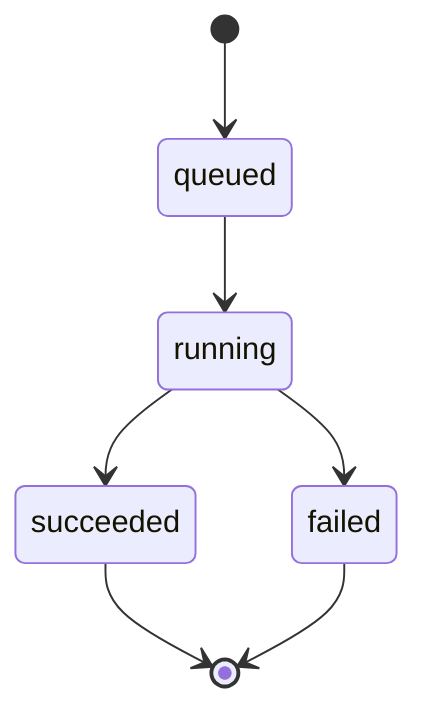

# 数据模型

## 核心模型

第一版只需要一个核心业务模型：`FormulaJob`。

它表示一次公式图片识别任务，从上传图片开始，到识别成功或失败结束。

在 UI 层，`FormulaJob` 可以被称为 `Mission` 或 `Recognition Mission`。这是界面叙事，不改变数据库模型名称。

## FormulaJob 字段设计

```text
id                 UUID 主键
mission_code       面向用户展示的任务编号
original_image     上传的原始图片
status             任务状态
progress           任务进度，0 到 100
stage_message      当前阶段说明
latex_result       识别得到的 LaTeX 文本
engine_name        实际使用的识别引擎
error_message      失败时的错误信息
created_at         创建时间
started_at         开始识别时间
finished_at        完成时间
duration_ms        识别耗时
```

`id` 继续作为内部主键和路由参数，不直接作为主要界面文案。`mission_code` 用于进度页、结果页和历史记录页展示，避免用户看到冗长 UUID。

推荐格式：

```text
FL-YYYYMMDD-0001
```

例如：

```text
FL-20260519-0007
```

生成策略：

- 创建 `FormulaJob` 时生成。
- 日期部分使用任务创建日期。
- 序号部分可以按当天任务数递增，或使用独立数据库序列。
- 字段设置 `unique=True`，避免重复。

当前实现采用保留 UUID 主键、同时新增 `mission_code` 字段的方式。这样不需要重构现有 URL、ForeignKey 和 Celery 参数，UI 展示和 API 返回都可以使用更友好的 Mission Code。

## 状态设计

任务状态建议使用固定枚举：

```text
queued      已入队
running     正在识别
succeeded   识别成功
failed      识别失败
```

状态流转如下：



## UI 阶段命名

工程状态保持简单，UI 阶段使用 Mission Control 文案：

```text
UPLOAD LOCKED       上传完成，任务已锁定
QUEUED              已进入后台队列
MODEL WARMUP        模型加载或预热
IMAGE PREPROCESS    图片预处理
INFERENCE           模型推理
LATEX POSTPROCESS   LaTeX 后处理
RESULT READY        结果就绪
FAILED              任务失败
```

这些阶段来自 `progress` 和 `stage_message`，前端不自行编造最终状态。

## 进度设计

进度不是纯前端动画，而是由后台任务在不同阶段更新。

建议第一版进度定义：

```text
10   上传完成，任务已创建
25   任务进入后台队列
40   模型加载或预热
60   图片预处理完成
80   模型推理完成
95   LaTeX 后处理完成
100  任务完成
```

如果某个阶段非常快，也仍然更新状态，保证前端可以看到合理的进度变化。

## 图片存储

上传图片应保存到 Django `MEDIA_ROOT` 下，例如：

```text
media/
  formula_uploads/
    2026/
      05/
        <uuid>.png
```

数据库只保存相对路径，不直接保存图片二进制内容。

## 历史记录

历史记录页直接查询 `FormulaJob` 表，按 `created_at` 倒序展示。

每条历史记录应显示：

- Mission Code。
- 原始图片缩略图。
- 当前状态。
- LaTeX 结果摘要。
- 创建时间。
- 完成耗时。
- 查看结果按钮。
- 复制 LaTeX 按钮。

## 后续可扩展模型

未来如果继续扩展，可以增加：

- `RecognitionEngine`：记录不同识别模型。
- `FormulaBatch`：支持批量上传。
- `FormulaFeedback`：用户修正识别结果。
- `User`：多人账号体系。

第一版不引入这些表，避免过早复杂化。
