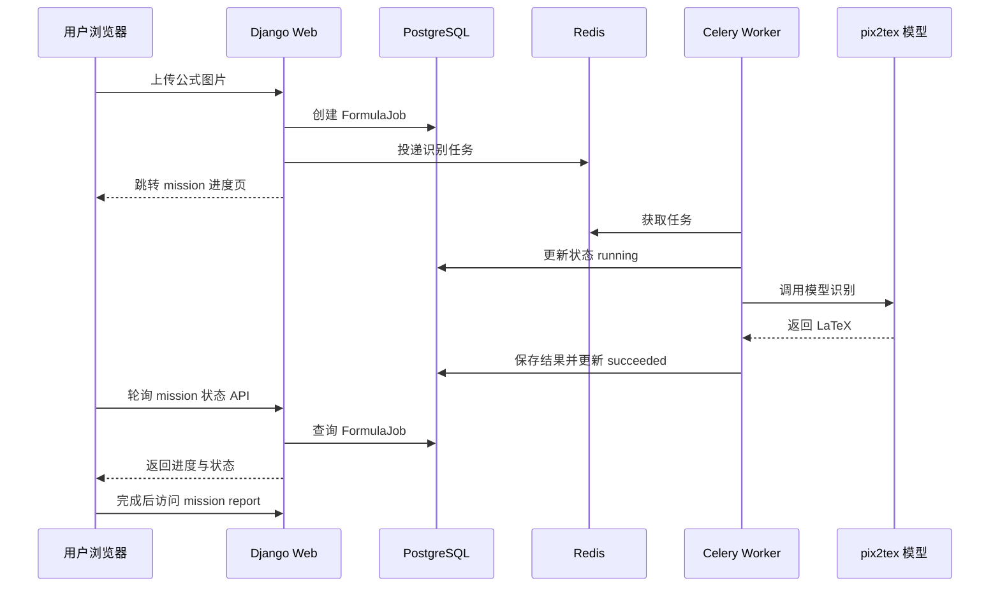

# 异步任务流程

## 为什么需要异步任务

公式图片识别不是普通表单提交。它可能涉及模型加载、图片预处理和深度学习推理。如果在一次 HTTP 请求里直接完成这些工作，用户会长时间等待，页面也容易超时。

因此 Formula Lab 使用 Celery 将识别过程放到后台执行。

在 UI 层，这个后台识别过程被表达为一次 `Recognition Mission`。用户看到的是 mission sequence，工程上仍然是 `FormulaJob + Celery task`。

## 完整流程



## API 设计

第一版建议提供以下接口：

```text
GET  /                  首页
POST /jobs/             上传图片并创建任务
GET  /missions/<uuid>/report/ 任务结果页
GET  /missions/<uuid>/progress/ 任务进度页
GET  /history/          历史记录页
GET  /api/missions/<uuid>/  查询任务状态 JSON
GET  /system/           系统状态页
GET  /api/system/health/ 查询系统健康状态 JSON
```

说明：上传创建接口保留 `/jobs/` 作为工程动作入口，创建的是内部 `FormulaJob`；用户可见页面和状态 API 使用 `/missions/`，保持 Mission Control 叙事。

## 任务状态 API 返回

示例：

```json
{
  "id": "3c5277f0-6b4c-4e70-86b7-541a6b801f88",
  "status": "running",
  "progress": 60,
  "stage_code": "IMAGE_PREPROCESS",
  "stage_label": "IMAGE PREPROCESS",
  "stage_message": "正在预处理公式图片",
  "result_url": null,
  "error_message": ""
}
```

任务完成后：

```json
{
  "id": "3c5277f0-6b4c-4e70-86b7-541a6b801f88",
  "status": "succeeded",
  "progress": 100,
  "stage_code": "RESULT_READY",
  "stage_label": "RESULT READY",
  "stage_message": "识别完成",
  "result_url": "/missions/3c5277f0-6b4c-4e70-86b7-541a6b801f88/report/",
  "error_message": ""
}
```

## 阶段映射

任务阶段建议统一由后端写入，前端只展示。

```text
UPLOAD_LOCKED       10   上传完成，任务已锁定
QUEUED              25   已进入后台队列
MODEL_WARMUP        40   模型加载或预热
IMAGE_PREPROCESS    60   图片预处理
INFERENCE           80   模型推理
LATEX_POSTPROCESS   95   LaTeX 后处理
RESULT_READY        100  结果就绪
FAILED              100  任务失败
```

UI 层显示 `stage_label`，例如 `MODEL WARMUP`。中文解释放在 `stage_message`。

## 错误处理

后台任务失败时，worker 需要捕获异常，并把错误写回数据库：

```text
status = failed
progress = 100
stage_message = 识别失败
error_message = 具体错误信息
finished_at = 当前时间
```

前端进度页检测到 `failed` 后，应显示错误原因和返回首页按钮。

失败也应标记失败发生在哪一层：

```text
upload_validation
queue_dispatch
model_warmup
image_preprocess
inference
latex_postprocess
database_update
unknown
```

这样进度页和系统状态页可以说清楚“哪里失败”，而不是只显示“识别失败”。

## 系统健康 API

系统状态页需要真实数据来源。建议 `GET /api/system/health/` 返回：

```json
{
  "web": {"status": "ok"},
  "database": {"status": "ok", "latency_ms": 12},
  "redis": {"status": "ok", "latency_ms": 8},
  "worker": {"status": "ok", "active_workers": 1},
  "model": {"status": "unknown", "message": "尚未执行模型预热"},
  "last_job": {
    "id": "3c5277f0-6b4c-4e70-86b7-541a6b801f88",
    "status": "succeeded",
    "finished_at": "2026-05-19T14:00:00+08:00"
  }
}
```

第一版可以先做轻量检查：

- database：执行简单查询。
- redis：执行 ping。
- worker：通过 Celery inspect ping 或最近 heartbeat 记录判断。
- model：读取最近一次模型加载状态，或由 worker 在识别时写入缓存/数据库。

## 进度条设计

进度条由后端阶段驱动，而不是纯前端定时器。前端可以做轻微过渡动画，但最终进度必须以 API 返回值为准。

进度条到达 100 时，前端自动跳转到结果页或失败页。
