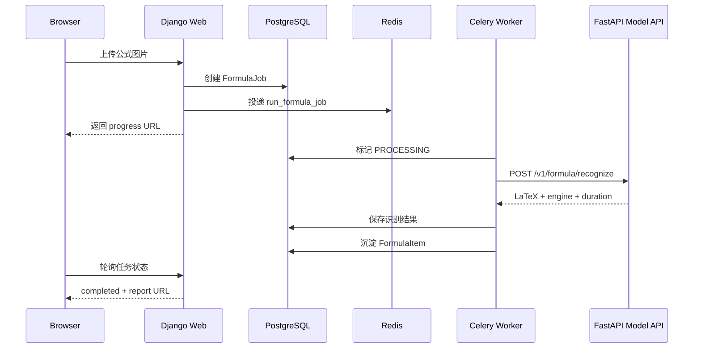
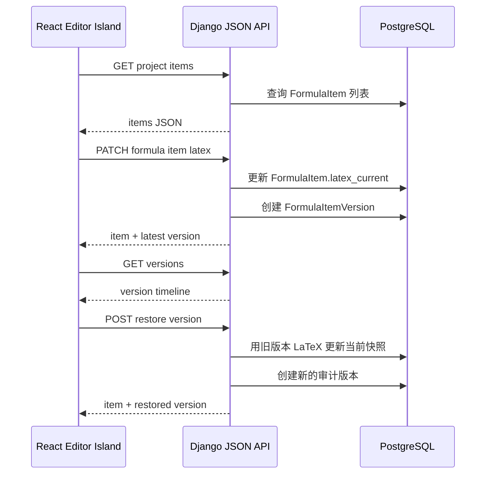

# 接口契约与数据流

## A 阶段数据流



## 模型服务 API

### `GET /health`

用途：健康检查和部署探针。

Response:

```json
{
  "status": "ready",
  "engine": "paddle",
  "model": "PP-FormulaNet_plus-S"
}
```

状态约定：

```text
ready    模型可用
warming  模型正在加载
error    模型不可用
unknown  尚未确认状态
```

HTTP 状态约定：

```text
200  ready
503  unknown / warming / error
```

### `GET /models/current`

用途：前端 System 页或部署检查展示当前模型。

Response:

```json
{
  "engine": "paddle",
  "model": "PP-FormulaNet_plus-S",
  "device": "cpu"
}
```

### `POST /warmup`

用途：主动触发模型加载。

Docker Compose healthcheck 使用该接口，因为它会真实触发模型预热。worker 依赖 `model-api` healthy 状态启动时，表示模型服务已经完成预热。

Response:

```json
{
  "status": "ready",
  "engine": "paddle",
  "model": "PP-FormulaNet_plus-S"
}
```

### `POST /v1/formula/recognize`

用途：识别单张公式图片。

Request:

```text
multipart/form-data
image=<file>
```

Response:

```json
{
  "latex": "\\int_0^1 x^2 dx",
  "engine": "paddle",
  "model": "PP-FormulaNet_plus-S",
  "duration_ms": 1830,
  "confidence": null
}
```

Error Response:

```json
{
  "error": "model warming",
  "code": "MODEL_NOT_READY"
}
```

## Django 配置项

```text
FORMULA_LAB_RECOGNITION_BACKEND=local | http
FORMULA_LAB_MODEL_API_URL=http://model-api:9000
FORMULA_LAB_MODEL_API_TIMEOUT_SECONDS=120
FORMULA_LAB_OCR_ENGINE=paddle
```

默认值：

```text
FORMULA_LAB_RECOGNITION_BACKEND=local
FORMULA_LAB_MODEL_API_URL=http://model-api:9000
FORMULA_LAB_MODEL_API_TIMEOUT_SECONDS=120
FORMULA_LAB_OCR_ENGINE=paddle
```

## 错误处理原则

模型服务错误不能导致 Django 页面崩溃。

Celery worker 收到错误后：

1. 将 `FormulaJob.status` 标记为 failed。
2. 将错误摘要写入 `FormulaJob.error_message`。
3. 保留原始图片和任务记录。
4. 让结果页或进度页显示可读错误。

推荐错误码：

```text
MODEL_NOT_READY
MODEL_TIMEOUT
MODEL_INFERENCE_FAILED
INVALID_IMAGE
UNSUPPORTED_ENGINE
```

## 为什么用 multipart 传图片

两个方案对比：

| 方案 | 优点 | 缺点 |
| --- | --- | --- |
| 共享 media volume，只传路径 | 快，少一次文件传输 | 容器路径耦合，Linux 部署和多机器部署容易出错 |
| multipart 上传图片 | 服务边界清楚，未来可跨机器 | 有一次 HTTP 文件传输开销 |

Formula Lab 当前选择 multipart，因为公式图片通常不大，边界清晰比极致性能更重要。

## B 阶段数据流



## B 阶段 Django JSON API

### `GET /api/projects/<project_id>/items/`

用途：Project Workspace 编辑器岛加载公式队列。

Response:

```json
{
  "project": {
    "id": "uuid",
    "project_code": "FP-20260523-0001",
    "name": "Paper title"
  },
  "items": [
    {
      "id": "uuid",
      "formula_code": "FF-20260523-0001",
      "latex_current": "\\alpha+\\beta",
      "review_status": "needs_review",
      "source_job_code": "FL-20260523-0001",
      "updated_at": "2026-05-23T10:00:00+08:00"
    }
  ]
}
```

### `GET /api/formula-items/<item_id>/`

用途：加载单条公式的编辑器详情。

Response:

```json
{
  "id": "uuid",
  "formula_code": "FF-20260523-0001",
  "latex_current": "\\alpha+\\beta",
  "review_status": "needs_review",
  "latest_version": {
    "id": 1,
    "source": "ocr",
    "created_by_label": "paddle"
  }
}
```

### `PATCH /api/formula-items/<item_id>/`

用途：编辑器保存当前 LaTeX。

Request:

```json
{
  "latex_current": "\\beta+\\gamma",
  "note": "manual correction"
}
```

行为：

- 更新 `FormulaItem.latex_current`。
- 将 `FormulaItem.status` 标记为 `edited`。
- 创建 `FormulaItemVersion(source=manual, created_by_label=api)`。

### `GET /api/formula-items/<item_id>/versions/`

用途：加载版本时间线。

Response:

```json
{
  "item_id": "uuid",
  "versions": [
    {
      "id": 2,
      "latex": "\\beta+\\gamma",
      "source": "manual",
      "created_by_label": "api",
      "note": "manual correction"
    }
  ]
}
```

### `POST /api/formula-items/<item_id>/versions/`

用途：显式创建人工版本，并同步当前快照。

Request:

```json
{
  "latex": "\\delta",
  "note": "fixed subscript"
}
```

Response status:

```text
201
```

### `POST /api/formula-items/<item_id>/versions/<version_id>/restore/`

用途：从版本时间线恢复旧 LaTeX。

行为：

- 只允许恢复同一个 `FormulaItem` 下的版本。
- 不修改历史版本本身。
- 将目标版本的 `latex` 写入 `FormulaItem.latex_current`。
- 创建新的 `FormulaItemVersion(source=manual, created_by_label=api)`，`note` 记录来源版本。

Response:

```json
{
  "item": {
    "id": "uuid",
    "latex_current": "\\alpha",
    "latest_version": {
      "id": 3,
      "source": "manual",
      "created_by_label": "api",
      "note": "restored from version 1"
    }
  },
  "version": {
    "id": 3,
    "latex": "\\alpha",
    "source": "manual",
    "created_by_label": "api",
    "note": "restored from version 1"
  }
}
```

## C 阶段论文文档 API

这一阶段把 Project Workspace 从公式素材区推进为论文项目空间。当前先建立文档与文件边界，后续 React 编辑器再接入文件树、源码编辑和 PDF preview。

### `GET /api/projects/<project_id>/documents/`

用途：加载项目下的论文文档和文件树。

Response:

```json
{
  "project": {
    "id": "uuid",
    "project_code": "FP-20260523-0001",
    "name": "Paper title"
  },
  "documents": [
    {
      "id": "uuid",
      "document_code": "FD-20260523-0001",
      "title": "Main manuscript",
      "root_file_path": "main.tex",
      "files": [
        {
          "id": "uuid",
          "path": "main.tex",
          "file_type": "tex",
          "content": "\\documentclass{article}"
        }
      ]
    }
  ]
}
```

### `POST /api/projects/<project_id>/documents/`

用途：创建默认论文文档，并自动生成 `main.tex`。

Request:

```json
{
  "title": "Draft one"
}
```

Response status:

```text
201
```

行为：

- 创建 `PaperDocument(project=<project>, root_file_path=main.tex)`。
- 创建 `PaperFile(path=main.tex, file_type=tex)`。
- `main.tex` 默认包含 `article`、`amsmath`、项目标题和基础正文骨架。

### `GET /api/document-files/<file_id>/`

用途：读取单个论文文件。

### `PATCH /api/document-files/<file_id>/`

用途：保存单个论文文件内容。

Request:

```json
{
  "content": "\\section{Method}"
}
```

行为：

- 只更新 `PaperFile.content`。
- 文件路径、文档归属、文件类型暂不通过该接口修改，避免编辑器第一版产生结构性破坏。

## B 阶段 API 原则

- React 不直接操作数据库。
- Django API 不返回过大的整页 HTML。
- 所有写入都经过 service 层。
- FormulaItem 当前值和版本历史都由后端保证一致性。
- API 命名使用工程语义，UI 文案继续使用 Mission Control 风格。
